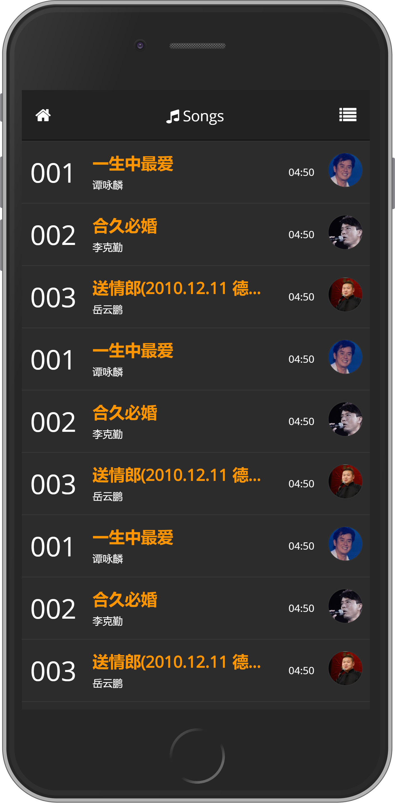
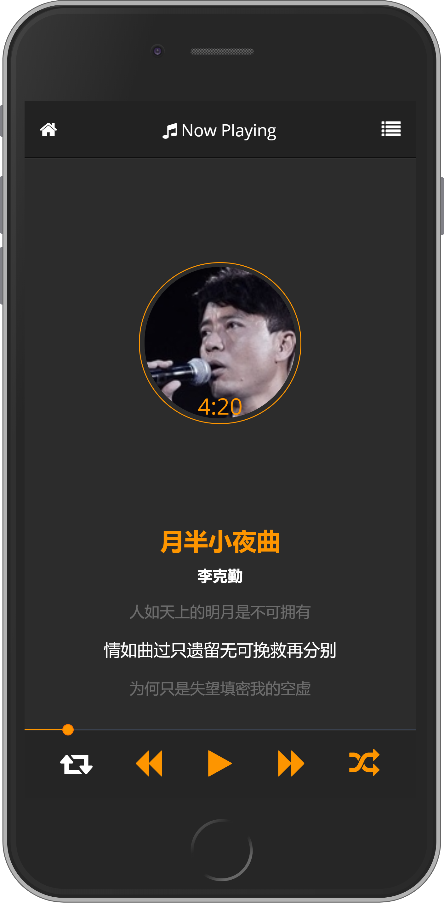

# music-player-pages

> A special feeling music player page

## Online demo

http://code.zce.me/music-player-pages/

## Preview

<!-- ## 搜索建议
http://tingapi.ting.baidu.com/v1/restserver/ting?from=qianqian&version=2.1.0&method=baidu.ting.search.catalogSug&format=json&query=%E5%B0%8F%E8%8B%B9%E6%9E%9C
搜索建议：只有歌名
http://tingapi.ting.baidu.com/v1/restserver/ting?method=baidu.ting.search.suggestion&query=%E5%B0%8F%E8%8B%B9%E6%9E%9C&format=json&from=ios&version=2.1.1
## 搜索结果
http://tingapi.ting.baidu.com/v1/restserver/ting?from=qianqian&version=2.1.0&method=baidu.ting.search.common&format=json&query=%E5%B0%8F%E8%8B%B9%E6%9E%9C&page_no=1&page_size=30
##
http://tingapi.ting.baidu.com/v1/restserver/ting?from=qianqian&version=2.1.0&method=baidu.ting.artist.getList&format=json&order=1&offset=0&limit=5
## 新歌榜
http://tingapi.ting.baidu.com/v1/restserver/ting?from=qianqian&version=2.1.0&method=baidu.ting.billboard.billList&format=json&type=1&offset=0&size=50
## 热歌榜
http://tingapi.ting.baidu.com/v1/restserver/ting?from=qianqian&version=2.1.0&method=baidu.ting.billboard.billList&format=json&type=2&offset=0&size=50  注意这个和上边的区别，type=1
## Billboard
http://tingapi.ting.baidu.com/v1/restserver/ting?from=qianqian&version=2.1.0&method=baidu.ting.billboard.billList&format=json&type=8&offset=0&size=507）Hito中文榜
## Hito中文榜
http://tingapi.ting.baidu.com/v1/restserver/ting?from=qianqian&version=2.1.0&method=baidu.ting.billboard.billList&format=json&type=18&offset=0&size=50
## KTV热歌榜
http://tingapi.ting.baidu.com/v1/restserver/ting?from=qianqian&version=2.1.0&method=baidu.ting.billboard.billList&format=json&type=6&offset=0&size=50
## 电台列表
http://tingapi.ting.baidu.com/v1/restserver/ting?from=qianqian&version=2.1.0&method=baidu.ting.radio.getCategoryList&format=json
## 获取某个电台下的歌曲列表
http://tingapi.ting.baidu.com/v1/restserver/ting?from=qianqian&version=2.1.0&method=baidu.ting.radio.getChannelSong&format=json&pn=0&rn=10&channelname=public_tuijian_ktv
## 获取songid的歌曲信息
http://tingapi.ting.baidu.com/v1/restserver/ting?from=qianqian&version=2.1.0&method=baidu.ting.song.getInfos&format=json&songid=8059247&ts=1408284347323&e=JoN56kTXnnbEpd9MVczkYJCSx%2FE1mkLx%2BPMIkTcOEu4%3D&nw=2&ucf=1&res=1
## 获取登陆用户的喜爱歌曲列表，其中bduss参数用来标示唯一的用户
http://tingapi.ting.baidu.com/v1/restserver/ting?from=qianqian&version=2.1.0&method=baidu.ting.favorite.getFavoriteSong&format=json&pn=0&rn=50&bduss=UlXZ1dWbm9icDBrMm13aFcwZ282ejlTM1dyS1NEd2JPWXpQcDgyT0w0Vn5SUmhVQVFBQUFBJCQAAAAAAAAAAAEAAAB0L~cOeHl3MDQzNzM1AAAAAAAAAAAAAAAAAAAAAAAAAAAAAAAAAAAAAAAAAAAAAAAAAAAAAAAAAAAAAAAAAAAAAAAAAH-48FN~uPBTd
## 歌手列表
http://tingapi.ting.baidu.com/v1/restserver/ting?from=qianqian&version=2.1.0&method=baidu.ting.artist.get72HotArtist&format=json&order=1&offset=0&limit=50
## 歌手简介，tinguid为歌手id
http://tingapi.ting.baidu.com/v1/restserver/ting?from=qianqian&version=2.1.0&method=baidu.ting.artist.getinfo&format=json&tinguid=7994
## 歌手歌曲列表，tinguid为歌手id
http://tingapi.ting.baidu.com/v1/restserver/ting?from=qianqian&version=2.1.0&method=baidu.ting.artist.getSongList&format=json&order=2&tinguid=7994&offset=0&limits=50
## 新碟上架
http://tingapi.ting.baidu.com/v1/restserver/ting?from=qianqian&version=2.1.0&method=baidu.ting.plaza.getRecommendAlbum&format=json&offset=0&limit=50
## 专辑信息
http://tingapi.ting.baidu.com/v1/restserver/ting?from=qianqian&version=2.1.0&method=baidu.ting.album.getAlbumInfo&format=json&album_id=122314357
## 新歌速递
http://tingapi.ting.baidu.com/v1/restserver/ting?from=qianqian&version=2.1.0&method=baidu.ting.plaza.getNewSongs&format=json&limit=50 -->
